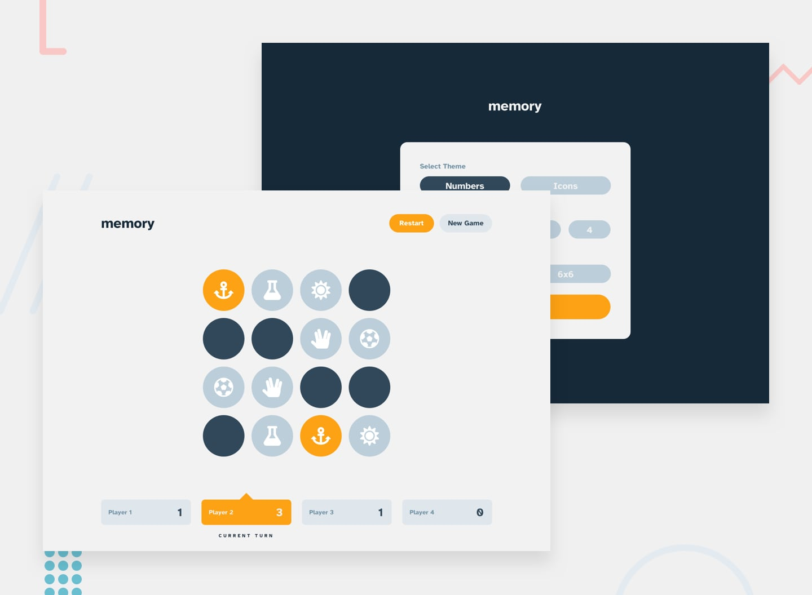

# Memory Game

For more details, please visit the [Memory Game](https://memory-game-colab.netlify.app/)

This repository contains the code for a memory game web application where you can play memory games with 1 player to multiplayer of 4 players. You have the option to choose the grid size for the game, such as 4x4 or 6x6.

## Pages

### index.html

The landing page of the Memory Game application. Users can choose the type of game (single player or multiplayer) and select the grid size (4x4 or 6x6).

### game.html

The game page where you can play the memory game. You have options to restart the game or start a new game. You can also navigate back to the index.html to choose a different game type or grid size.

## Gameplay

The memory game involves flipping cards to find matching pairs. The objective is to match all pairs in the shortest possible time and with the fewest moves.

## Getting Started

To set up the Memory Game project, follow these steps:

1. Clone the repository to your local machine.
2. Open the project folder and navigate to the index.html file.
3. Open index.html in a web browser to start the game and choose your preferred game settings.

## Features

- Choose the type of game: single player or multiplayer (up to 4 players).
- Select the grid size: 4x4 or 6x6.
- Play and enjoy the memory game, trying to match all pairs.

## Authors

- Avtandil Gvenetadze
- Irakli Darjania
- Giorgi Beruashvili

## Mentor

Tedo Janelidze

## Note

This project does not require any external dependencies or libraries. It uses HTML, CSS, and JavaScript to implement the memory game functionality.
